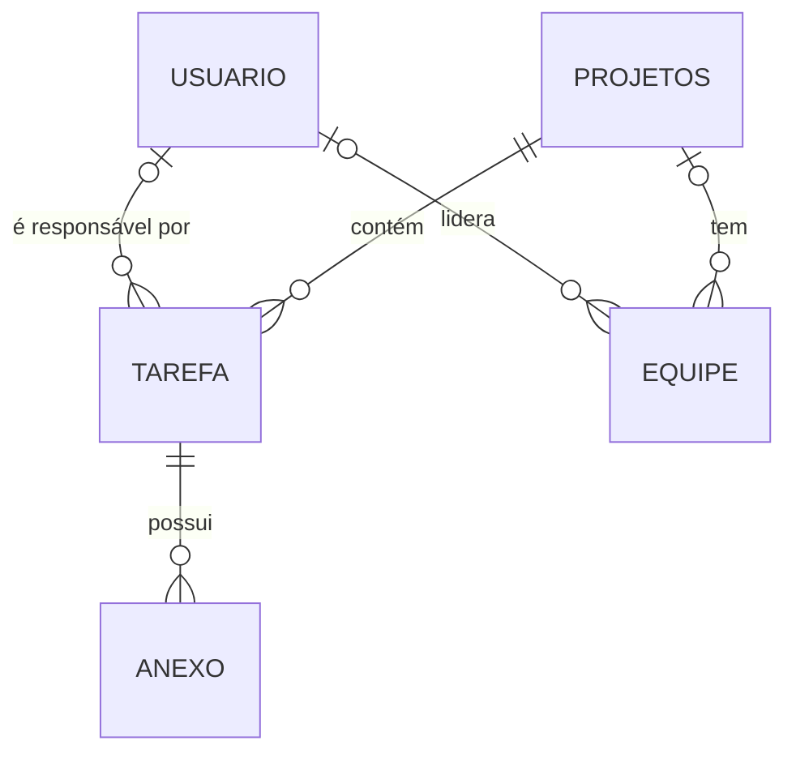

# Gerenciamento de Projetos

- Integrantes: Alice Martins Miranda, Arthur Souza Ribeiro, Arthur Yuji Mendes Suzuki, Felipe Souza de Jesus e Luiz Miguel Mazega Lamas

API REST para acompanhar projetos, tarefas, equipes, usuários e anexos, construída com Spring Boot e MySQL, com autenticação HTTP Basic e documentação interativa via Swagger.

## Sumário

- [Funcionalidades](#funcionalidades)
- [Tecnologias](#tecnologias)
- [Modelo de dados](#modelo-de-dados)
- [Estrutura do projeto](#estrutura-do-projeto)
- [Como executar](#como-executar)
- [Autenticação e permissões](#autenticação-e-permissões)
- [Endpoints](#endpoints)
- [Exemplos de uso](#exemplos-de-uso)
- [Regras e detalhes da API](#regras-e-detalhes-da-api)
- [Testes](#testes)

## Funcionalidades

- CRUD completo de usuários, projetos, tarefas, equipes e anexos.
- Listagem de tarefas por projeto ou por responsável.
- Listagem de projetos com paginação e ordenação.
- Validação dos dados de entrada, com mensagens de erro por campo.
- Controle de acesso por perfil (`ADMIN` e demais usuários).
- Documentação OpenAPI/Swagger e collection do Postman prontas para uso.

## Tecnologias

| Camada         | Tecnologia                                                    |
|----------------|---------------------------------------------------------------|
| Linguagem      | Java 21                                                       |
| Framework      | Spring Boot 4.1.1 (Web MVC, Data JPA, Validation, Security)   |
| Banco de dados | MySQL 8                                                       |
| Documentação   | springdoc-openapi 3.1.1 (Swagger UI)                          |
| Utilitários    | Lombok                                                        |
| Build          | Maven                                                         |
| Testes         | JUnit 5, Mockito e MockMvc                                    |

## Modelo de dados



Comportamento das chaves estrangeiras (definido em `Gerenciamentoprojeto.sql`):

- Excluir um projeto exclui suas tarefas e, em cascata, os anexos delas.
- Excluir uma tarefa exclui seus anexos.
- Excluir um usuário mantém as tarefas e equipes dele, apenas removendo o vínculo (responsável/líder fica vazio).
- Excluir um projeto mantém as equipes, sem o vínculo com o projeto.

## Estrutura do projeto

```
Gerenciamento-de-Projetos/
├── Gerenciamentoprojeto.sql                        # script de criação do banco
├── Gerenciamento-Projetos.postman_collection.json  # requisições prontas
├── pom.xml                                         # POM pai (Spring Boot 4.1.1, Java 21)
└── gerenciador-projetos/                           # módulo da aplicação
    ├── pom.xml
    └── src/
        ├── main/
        │   ├── java/br/unisales/gerenciador_projetos/
        │   │   ├── controller/   # rotas REST
        │   │   ├── service/      # regras de negócio
        │   │   ├── repository/   # acesso ao banco (Spring Data JPA)
        │   │   ├── entity/       # entidades JPA
        │   │   ├── dto/          # objetos de entrada e saída da API
        │   │   ├── exception/    # tratamento global de erros
        │   │   ├── security/     # login (HTTP Basic) e permissões
        │   │   └── config/       # configuração do Swagger/OpenAPI
        │   └── resources/
        │       └── application.properties
        └── test/java/br/unisales/gerenciador_projetos/
            ├── ControllersTest.java
            ├── DtoTest.java
            └── GerenciadorProjetosApplicationTests.java
```

## Como executar

### Pré-requisitos

- JDK 21
- Maven 3.9 ou superior
- MySQL 8 em execução na porta `3306`

### 1. Clonar o repositório

```bash
git clone <url-do-repositorio>
cd Gerenciamento-de-Projetos
```

### 2. Criar o banco de dados

O script cria o banco `gestao_projetos` e todas as tabelas:

```bash
mysql -u root -p < Gerenciamentoprojeto.sql
```

> A aplicação usa `spring.jpa.hibernate.ddl-auto=none`: ela não cria nem altera tabelas sozinha. O script SQL precisa ser executado antes.

### 3. Configurar as credenciais do banco

A conexão usa `jdbc:mysql://localhost:3306/gestao_projetos` e lê usuário e senha de variáveis de ambiente:

| Variável      | Padrão | Descrição            |
|---------------|--------|----------------------|
| `DB_USER`     | `root` | Usuário do MySQL     |
| `DB_PASSWORD` | `2501` | Senha do MySQL       |

Defina as suas antes de subir a aplicação:

```bash
# Linux / macOS
export DB_USER=root
export DB_PASSWORD=sua_senha

# Windows (PowerShell)
$env:DB_USER="root"
$env:DB_PASSWORD="sua_senha"
```

### 4. Subir a aplicação

```bash
cd gerenciador-projetos
mvn spring-boot:run
```

A API fica disponível em `http://localhost:8080`.

Para gerar o `.jar` e executá-lo:

```bash
mvn clean package
java -jar target/gerenciador-projetos-0.0.1-SNAPSHOT.jar
```

### 5. Criar o primeiro usuário administrador

Todas as rotas (exceto o cadastro de usuário e o Swagger) exigem autenticação. Como o banco começa vazio, o primeiro acesso é criando um administrador pela rota pública de cadastro:

```bash
curl -X POST http://localhost:8080/api/usuarios \
  -H "Content-Type: application/json" \
  -d '{
    "nome": "Administrador",
    "login": "admin",
    "senha": "admin123",
    "funcao": "ADMIN"
  }'
```

A partir daí, use `admin` / `admin123` nas demais requisições.

## Autenticação e permissões

A API usa HTTP Basic (sessão stateless): envie `login` e `senha` em toda requisição.

| Rota                                   | Quem acessa                  |
|----------------------------------------|------------------------------|
| `/swagger-ui/**` e `/v3/api-docs/**`   | Público                      |
| `POST /api/usuarios` (cadastro)        | Público                      |
| Demais rotas de `/api/usuarios/**`     | Apenas perfil `ADMIN`        |
| Todas as outras rotas                  | Qualquer usuário autenticado |

O perfil vem do campo `funcao` do usuário: o valor é convertido para maiúsculas e vira a autoridade `ROLE_<FUNCAO>` (por exemplo, `admin` → `ROLE_ADMIN`). Se `funcao` estiver vazio, o usuário recebe `USER`.

## Endpoints

Todos ficam sob o prefixo `/api`.

| Recurso     | Rotas                                                                    |
|-------------|--------------------------------------------------------------------------|
| `/usuarios` | `GET`, `GET /{id}`, `POST`, `PUT /{id}`, `DELETE /{id}`                  |
| `/projetos` | as mesmas cinco + `GET /paginado` e `GET /{id}/tarefas`                  |
| `/tarefas`  | as mesmas cinco, o `GET` aceita `?projetoId=` ou `?responsavelId=`       |
| `/equipes`  | as mesmas cinco                                                          |
| `/anexos`   | as mesmas cinco, o `GET` aceita `?tarefaId=`                             |

Códigos de resposta: `200` (consulta e atualização), `201` (criação, com o cabeçalho `Location`), `204` (exclusão), `400` (dados inválidos) e `404` (equipe não encontrada).

## Exemplos de uso

Os exemplos assumem o administrador criado no passo 5.

**Criar um projeto**

```bash
curl -X POST http://localhost:8080/api/projetos \
  -u admin:admin123 \
  -H "Content-Type: application/json" \
  -d '{
    "nome": "Portal do Cliente",
    "supervisor": "Maria Souza",
    "descricao": "Novo portal de atendimento",
    "dataInicio": "2026-03-01",
    "dataFim": "2026-08-31",
    "status": "Em Andamento"
  }'
```

**Criar uma tarefa**

```bash
curl -X POST http://localhost:8080/api/tarefas \
  -u admin:admin123 \
  -H "Content-Type: application/json" \
  -d '{
    "titulo": "Implementar login",
    "prazo": "2026-03-15",
    "prioridade": "Alta",
    "status": "A fazer",
    "idProjeto": 1,
    "idResponsavel": 1
  }'
```

**Criar uma equipe** (`idUsuario` é o líder)

```bash
curl -X POST http://localhost:8080/api/equipes \
  -u admin:admin123 \
  -H "Content-Type: application/json" \
  -d '{
    "nome": "Backend",
    "descricao": "Equipe da API",
    "idProjeto": 1,
    "idUsuario": 1
  }'
```

**Registrar um anexo** (só a URL do arquivo é guardada)

```bash
curl -X POST http://localhost:8080/api/anexos \
  -u admin:admin123 \
  -H "Content-Type: application/json" \
  -d '{
    "idTarefa": 1,
    "nomeArquivo": "especificacao.pdf",
    "urlArquivo": "https://exemplo.com/especificacao.pdf",
    "tipoArquivo": "application/pdf"
  }'
```

**Listar projetos com paginação**

```bash
curl -u admin:admin123 \
  "http://localhost:8080/api/projetos/paginado?pagina=0&tamanho=10&ordenarPor=idProjeto"
```

A resposta traz `conteudo`, `pagina`, `tamanho`, `totalElementos`, `totalPaginas`, `primeira` e `ultima`.

**Exemplo de erro de validação (`400`)**

```json
{
  "nome": "O nome do projeto é obrigatório"
}
```

## Regras e detalhes da API

**Campos obrigatórios**

| Recurso | Obrigatórios                             | Observações                                           |
|---------|------------------------------------------|-------------------------------------------------------|
| Usuário | `nome`, `login`, `senha`                 | `login` de 3 a 50 caracteres; `senha` com no mínimo 6 |
| Projeto | `nome`                                   | máximo de 255 caracteres                              |
| Tarefa  | `titulo`, `idProjeto`                    | `idResponsavel` é opcional                            |
| Equipe  | `nome`                                   | `idProjeto` e `idUsuario` (líder) são opcionais       |
| Anexo   | `idTarefa`, `nomeArquivo`, `urlArquivo`  | `tipoArquivo` e `idUsuario` são opcionais             |

**Comportamento geral**

- Datas usam o formato `yyyy-MM-dd`.
- `status` e `prioridade` são texto livre, sem enum. O script SQL sugere valores como *Baixa, Média, Alta, Crítica* (prioridade) e *A fazer, Em andamento, Concluída, Bloqueada* (status da tarefa).
- As listagens de usuários, projetos e equipes voltam resumidas; a busca por id traz o registro completo.
- Em `/tarefas`, se `projetoId` e `responsavelId` vierem juntos, só o `projetoId` é considerado.
- Na paginação, `pagina` começa em `0` e `ordenarPor` deve ser o nome de um atributo do projeto (`idProjeto`, `nome`, `dataInicio`, etc.).
- `PUT` substitui todos os campos: envie o corpo completo, inclusive a `senha` ao atualizar um usuário.
- O anexo guarda apenas a URL do arquivo.

## Testes

```bash
cd gerenciador-projetos
mvn test
```

| Classe                                | O que cobre                                                                                                                                                                         |
|---------------------------------------|-------------------------------------------------------------------------------------------------------------------------------------------------------------------------------------|
| `ControllersTest`                     | Os cinco controllers, com MockMvc e services mockados (sem banco e sem subir o Spring): status HTTP, validação (`400`), `404`, `Location` do `201`, filtros, paginação e ausência da senha nas respostas. Login e perfis do Spring Security ficam de fora. |
| `DtoTest`                             | Conversão entre entidade e DTO e regras de validação.                                                                                                                               |
| `GerenciadorProjetosApplicationTests` | Confere se o contexto do Spring sobe. Precisa do MySQL rodando com o banco criado.                                                                                              |
