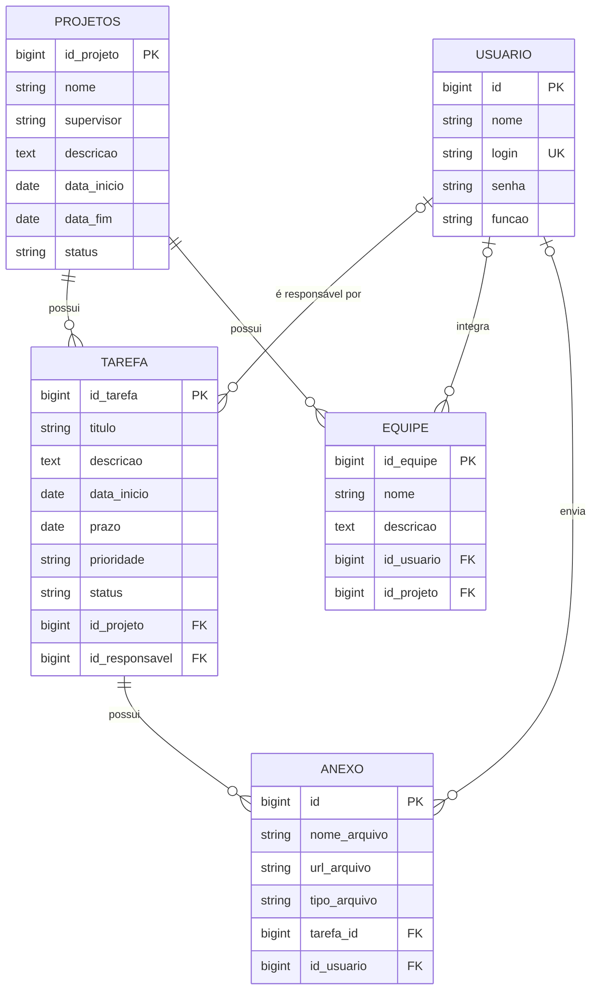

# Gerenciamento de Projetos
# INTEGRANTES: Alice Martins Miranda, Arthur Souza Ribeiro, Arthur Yuji Mendes Suzuki, Felipe Souza de Jesus, Luiz Miguel Mazega Lamas

API REST para gerenciar projetos, tarefas, equipes, usuários e anexos, construída com Spring Boot e MySQL.

## Sumário

- [Funcionalidades](#funcionalidades)
- [Tecnologias](#tecnologias)
- [Estrutura do projeto](#estrutura-do-projeto)
- [Modelo de dados](#modelo-de-dados)
- [Pré-requisitos](#pré-requisitos)
- [Como executar](#como-executar)
- [Autenticação](#autenticação)
- [Endpoints](#endpoints)
- [Exemplos de uso](#exemplos-de-uso)
- [Validações e tratamento de erros](#validações-e-tratamento-de-erros)
- [Testes](#testes)

---

## Funcionalidades

- CRUD completo de usuários, projetos, tarefas, equipes e anexos
- Listagem de tarefas por projeto ou por responsável
- Listagem de anexos por tarefa
- Listagem paginada e ordenável de projetos
- Validação dos dados de entrada com mensagens de erro por campo
- DTOs de entrada e saída: a senha do usuário nunca é devolvida nas respostas
- Autenticação HTTP Basic (Spring Security)

## Tecnologias

| Tecnologia                  | Versão / detalhe                              |
|-----------------------------|-----------------------------------------------|
| Java                        | 21                                            |
| Spring Boot                 | 4.1.1                                         |
| Spring Web MVC              | API REST                                      |
| Spring Data JPA             | Persistência (Hibernate)                      |
| Spring Validation           | Bean Validation (`jakarta.validation`)        |
| Spring Security             | HTTP Basic                                    |
| MySQL                       | Banco de dados (driver `mysql-connector-j`)   |
| Lombok                      | Redução de código repetitivo nas entidades    |
| Gradle                      | Wrapper 9.7.1                                 |
| JUnit 5 + MockMvc + Mockito | Testes                                        |

## Estrutura do projeto

```
Gerenciamento-de-Projetos/
|-- Gerenciamentoprojeto.sql          # Script de criação do banco de dados
`-- gerenciador-projetos/
    |-- build.gradle.kts
    |-- gradlew / gradlew.bat
    `-- src/
        |-- main/
        |   |-- java/br/unisales/gerenciador_projetos/
        |   |   |-- controller/       # Endpoints REST
        |   |   |-- service/          # Regras de negócio
        |   |   |-- repository/       # Interfaces Spring Data JPA
        |   |   |-- entity/           # Entidades JPA
        |   |   |-- dto/              # Objetos de entrada e saída (records)
        |   |   |-- exception/        # Exceções e handler global
        |   |   `-- security/         # Configuração do Spring Security
        |   `-- resources/
        |       `-- application.properties
        `-- test/                     # Testes de controllers e DTOs
```

A aplicação segue a arquitetura em camadas: Controller > Service > Repository > Banco, com DTOs isolando o contrato da API das entidades JPA.

## Modelo de dados



*Regras de exclusão que foram definidas no script SQL: ao excluir um projeto, suas tarefas são removidas em cascata; ao excluir uma tarefa, seus anexos também. Ao excluir um usuário, os vínculos dele (responsável de tarefa, equipe) passam a `NULL`.

## Pré-requisitos

- JDK 21
- MySQL 8+
- Git

## Como executar

### 1. Clone o repositório

```bash
git clone https://github.com/<seu-usuario>/Gerenciamento-de-Projetos.git
cd Gerenciamento-de-Projetos
```

### 2. Crie o banco de dados

O script cria o banco `gestao_projetos` e todas as tabelas:

```bash
mysql -u root -p < Gerenciamentoprojeto.sql
```

> *Atenção: o script atual tem três divergências em relação às entidades JPA. Execute os comandos abaixo depois do script (ou ajuste o próprio `.sql`):
>
> ```sql
> USE gestao_projetos;
>
> -- Entidade Usuario usa a coluna "funcao" (sem acento)
> ALTER TABLE USUARIO CHANGE COLUMN `Função` funcao VARCHAR(50);
>
> -- Entidade Projeto usa a coluna "descricao" (sem acento/cedilha)
> ALTER TABLE PROJETOS CHANGE COLUMN `DESCRIÇÃO` descricao TEXT;
>
> -- Entidade Anexo mapeia a coluna "id_usuario", que não existe no script
> ALTER TABLE ANEXO
>   ADD COLUMN id_usuario INT NULL,
>   ADD CONSTRAINT fk_anexo_usuario FOREIGN KEY (id_usuario)
>       REFERENCES USUARIO(Id) ON DELETE SET NULL ON UPDATE CASCADE;
> ```

### 3. Configure a conexão

O arquivo `gerenciador-projetos/src/main/resources/application.properties` ainda não define a conexão com o banco. Adicione:

```properties
spring.application.name=gerenciador-projetos

# Conexão com o MySQL
spring.datasource.url=jdbc:mysql://localhost:3306/gestao_projetos?serverTimezone=UTC
spring.datasource.username=${DB_USER:root}
spring.datasource.password=${DB_PASSWORD:sua_senha}

# O schema é criado pelo script SQL; o Hibernate não deve alterá-lo
spring.jpa.hibernate.ddl-auto=none
spring.jpa.show-sql=false
```

As variáveis `DB_USER` e `DB_PASSWORD` podem ser definidas no ambiente para evitar senha no código.

### 4. Execute a aplicação

```bash
cd gerenciador-projetos

# Linux / macOS
./gradlew bootRun

# Windows
gradlew.bat bootRun
```

A API ficará disponível em **http://localhost:8080**.

Para gerar o `.jar`:

```bash
./gradlew bootJar
java -jar build/libs/gerenciador-projetos-0.0.1-SNAPSHOT.jar
```

## Autenticação

Todos os endpoints exigem HTTP Basic. Enquanto a autenticação não estiver integrada á tabela `USUARIO`, o Spring Security usa o usuário padrão `user`, com uma senha gerada aleatoriamente e exibida no console ao iniciar a aplicação:

```
Using generated security password: 3f1c2d7e-....
```

Para definir credenciais fixas em desenvolvimento, adicione ao `application.properties`:

```properties
spring.security.user.name=admin
spring.security.user.password=admin123
```

Envie as credenciais em cada requisitúo:

```bash
curl -u admin:admin123 http://localhost:8080/api/projetos
```

> O CSRF está desabilitado, pois a API é consumida via HTTP Basic (sem sessão de navegador).

## Endpoints

URL base: `http://localhost:8080/api`

### Usuários — `/api/usuarios`

| Método | Rota | Descrição | Sucesso |
|---|---|---|---|
| GET | `/api/usuarios` | Lista usuários (resumo: `id`, `nome`, `login`) | 200 |
| GET | `/api/usuarios/{id}` | Busca um usuário | 200 |
| POST | `/api/usuarios` | Cria um usuário | 201 + `Location` |
| PUT | `/api/usuarios/{id}` | Atualiza um usuário | 200 |
| DELETE | `/api/usuarios/{id}` | Remove um usuário | 204 |

### Projetos — `/api/projetos`

| Método | Rota | Descrição | Sucesso |
|---|---|---|---|
| GET | `/api/projetos` | Lista projetos (resumo: `idProjeto`, `nome`, `status`) | 200 |
| GET | `/api/projetos/paginado` | Lista paginada. Parâmetros: `pagina` (padrão `0`), `tamanho` (padrão `10`), `ordenarPor` (padrão `idProjeto`) | 200 |
| GET | `/api/projetos/{id}` | Busca um projeto | 200 |
| GET | `/api/projetos/{id}/tarefas` | Lista as tarefas de um projeto | 200 |
| POST | `/api/projetos` | Cria um projeto | 201 + `Location` |
| PUT | `/api/projetos/{id}` | Atualiza um projeto | 200 |
| DELETE | `/api/projetos/{id}` | Remove um projeto | 204 |

### Tarefas — `/api/tarefas`

| Método | Rota | Descrição | Sucesso |
|---|---|---|---|
| GET | `/api/tarefas` | Lista todas as tarefas | 200 |
| GET | `/api/tarefas?projetoId={id}` | Filtra por projeto | 200 |
| GET | `/api/tarefas?responsavelId={id}` | Filtra por responsável | 200 |
| GET | `/api/tarefas/{id}` | Busca uma tarefa | 200 |
| POST | `/api/tarefas` | Cria uma tarefa | 201 + `Location` |
| PUT | `/api/tarefas/{id}` | Atualiza uma tarefa | 200 |
| DELETE | `/api/tarefas/{id}` | Remove uma tarefa | 204 |

> Se `projetoId` e `responsavelId` forem enviados juntos, apenas `projetoId` é considerado.

### Equipes — `/api/equipes`

| Método | Rota | Descrição | Sucesso |
|---|---|---|---|
| GET | `/api/equipes` | Lista equipes (resumo: `idEquipe`, `nome`) | 200 |
| GET | `/api/equipes/{id}` | Busca uma equipe (com projeto e usuário resumidos) | 200 |
| POST | `/api/equipes` | Cria uma equipe | 201 + `Location` |
| PUT | `/api/equipes/{id}` | Atualiza uma equipe | 200 |
| DELETE | `/api/equipes/{id}` | Remove uma equipe | 204 |

### Anexos — `/api/anexos`

| Método | Rota | Descrição | Sucesso |
|---|---|---|---|
| GET | `/api/anexos` | Lista todos os anexos | 200 |
| GET | `/api/anexos?tarefaId={id}` | Lista os anexos de uma tarefa | 200 |
| GET | `/api/anexos/{id}` | Busca um anexo | 200 |
| POST | `/api/anexos` | Cria um anexo | 201 + `Location` |
| PUT | `/api/anexos/{id}` | Atualiza um anexo | 200 |
| DELETE | `/api/anexos/{id}` | Remove um anexo | 204 |

> Os anexos guardam apenas a **URL** do arquivo (`urlArquivo`); a API não faz upload de arquivos.

## Corpos das requisições

Campos marcados com \* são obrigatórios. Datas usam o formato `yyyy-MM-dd`.

**Usuário (`POST` / `PUT`)

| Campo     | Tipo   | Regra                    |
|-----------|--------|--------------------------|
| `nome`\*  | string | não pode ser vazio      |
| `login`\* | string | 3 a 50 caracteres, único |
| `senha`\* | string | mínimo de 6 caracteres   |
| `funcao` | string  | opcional                 |

**Projeto (`POST` / `PUT`)

| Campo        | Tipo   | Regra                                   |
|--------------|--------|-----------------------------------------|
| `nome`\*     | string | não pode ser vazio, máx. 255 caracteres |
| `supervisor` | string | opcional                                |
| `descricao`  | string | opcional                                |
| `dataInicio` | date   | opcional                                |
| `dataFim`    | date   | opcional                                |
| `status`     | string | opcional                                |

**Tarefa (`POST` / `PUT`)

| Campo           | Tipo   | Regra                                |
|-----------------|--------|--------------------------------------|
| `titulo`\*      | string | não pode ser vazio                   |
| `idProjeto`\*   | number | id de um projeto existente           |
| `descricao`     | string | opcional                             |
| `dataInicio`    | date   | opcional                             |
| `prazo`         | date   | opcional                             |
| `prioridade`    | string | opcional                             |
| `status`        | string | opcional                             |
| `idResponsavel` | number | opcional; id de um usuário existente |

**Equipe (`POST` / `PUT`)

| Campo       | Tipo   | Regra                                |
|-------------|--------|--------------------------------------|
| `nome`\*    | string | não pode ser vazio                   |
| `descricao` | string | opcional                             |
| `idProjeto` | number | opcional; id de um projeto existente |
| `idUsuario` | number | opcional; id de um usuário existente |

**Anexo (`POST` / `PUT`)

| Campo           | Tipo   | Regra |
|-----------------|--------|------------------------------------|
| `idTarefa`\*    | number | id de uma tarefa existente         |
| `nomeArquivo`\* | string | não pode ser vazio                 |
| `urlArquivo`\*  | string | não pode ser vazio                 |
| `tipoArquivo`   | string | opcional (ex.: `application/pdf`)  |
| `idUsuario`     | number | opcional; id do usuário que anexou |

## Exemplos de uso

Os exemplos assumem as credenciais `admin:admin123` (veja [Autenticação](#autenticação)).

### Criar um usuário

```bash
curl -X POST http://localhost:8080/api/usuarios \
  -u admin:admin123 \
  -H "Content-Type: application/json" \
  -d '{
    "nome": "Felipe",
    "login": "felipe",
    "senha": "senha123",
    "funcao": "DEV"
  }'
```

Resposta `201 Created` (a senha não é devolvida):

```json
{
  "id": 1,
  "nome": "Felipe",
  "login": "felipe",
  "funcao": "DEV"
}
```

### Criar um projeto

```bash
curl -X POST http://localhost:8080/api/projetos \
  -u admin:admin123 \
  -H "Content-Type: application/json" \
  -d '{
    "nome": "Sistema de Organização de Projetos",
    "supervisor": "Arthur",
    "descricao": "Desenvolver um sistema agrupando e organizando projetos",
    "dataInicio": "2026-03-01",
    "dataFim": "2026-08-30",
    "status": "EM_ANDAMENTO"
  }'
```

### Criar uma tarefa

```bash
curl -X POST http://localhost:8080/api/tarefas \
  -u admin:admin123 \
  -H "Content-Type: application/json" \
  -d '{
    "titulo": "Implementar login",
    "descricao": "Adicionar tela de login",
    "dataInicio": "2026-03-02",
    "prazo": "2026-03-15",
    "prioridade": "ALTA",
    "status": "PENDENTE",
    "idProjeto": 1,
    "idResponsavel": 1
  }'
```

Resposta `201 Created`, com projeto e responsável em formato resumido:

```json
{
  "idTarefa": 1,
  "titulo": "Implementar login",
  "descricao": "Adicionar tela de login",
  "dataInicio": "2026-03-02",
  "prazo": "2026-03-15",
  "prioridade": "ALTA",
  "status": "PENDENTE",
  "projeto": { "idProjeto": 1, "nome": "de Organização de Projetos", "status": "EM_ANDAMENTO" },
  "responsavel": { "id": 1, "nome": "Felipe", "login": "felipe" }
}
```

### Listar tarefas de um projeto

```bash
curl -u admin:admin123 "http://localhost:8080/api/tarefas?projetoId=1"
# equivalente: GET /api/projetos/1/tarefas
```

### Listagem paginada de projetos

```bash
curl -u admin:admin123 "http://localhost:8080/api/projetos/paginado?pagina=0&tamanho=5&ordenarPor=nome"
```

```json
{
  "conteudo": [
    { "idProjeto": 1, "nome": "de Organização de Projetos", "status": "EM_ANDAMENTO" }
  ],
  "pagina": 0,
  "tamanho": 5,
  "totalElementos": 1,
  "totalPaginas": 1,
  "primeira": true,
  "ultima": true
}
```

> `pagina` começa em `0`. `ordenarPor` aceita o nome de qualquer atributo da entidade Projeto (`idProjeto`, `nome`, `supervisor`, `dataInicio`, `dataFim`, `status`).

### Adicionar um anexo a uma tarefa

```bash
curl -X POST http://localhost:8080/api/anexos \
  -u admin:admin123 \
  -H "Content-Type: application/json" \
  -d '{
    "idTarefa": 1,
    "nomeArquivo": "wireframe-login.pdf",
    "urlArquivo": "https://exemplo.com/arquivos/wireframe-login.pdf",
    "tipoArquivo": "application/pdf",
    "idUsuario": 1
  }'
```

## Validações e tratamento de erros

| Código             | Quando ocorre                                                   |
|--------------------|-----------------------------------------------------------------|
| `200 OK`           | Consulta ou atualização realizada                               |
| `201 Created`      | Recurso criado (o header `Location` aponta para o novo recurso) |
| `204 No Content`   | Recurso removido                                                |
| `400 Bad Request`  | Corpo inválido (falha na validação)                             |
| `401 Unauthorized` | Credenciais ausentes ou incorretas                              |
| `404 Not Found`    | Recurso não encontrado                                          |

*Erro de validação (400): o corpo é um objeto no formato `campo: mensagem`:

```json
{
  "login": "O login deve ter entre 3 e 50 caracteres",
  "senha": "A senha deve ter no mínimo 6 caracteres"
}
```

*Recurso não encontrado (404): o corpo é o texto da mensagem:

```
Equipe 99 não encontrada
```

## Testes

```bash
cd gerenciador-projetos
./gradlew test
```

No Windows, use `gradlew.bat test`.

A suíte cobre:

- `ControllersTest`: testa os cinco controllers com `@WebMvcTest` + `MockMvc`, com os services mockados. Verifica status HTTP, validações (400), recursos inexistentes (404), o header `Location` no `201` e garante que a senha não vaze na resposta.
- `DtoTest`: testa a conversão entre entidade e DTO (incluindo relacionamentos nulos) e as regras de Bean Validation.
- `GerenciadorProjetosApplicationTests`: teste `contextLoads`. Por subir o contexto completo, precisa da conexão com o MySQL configurada.

O relatório HTML fica em `build/reports/tests/test/index.html`.
